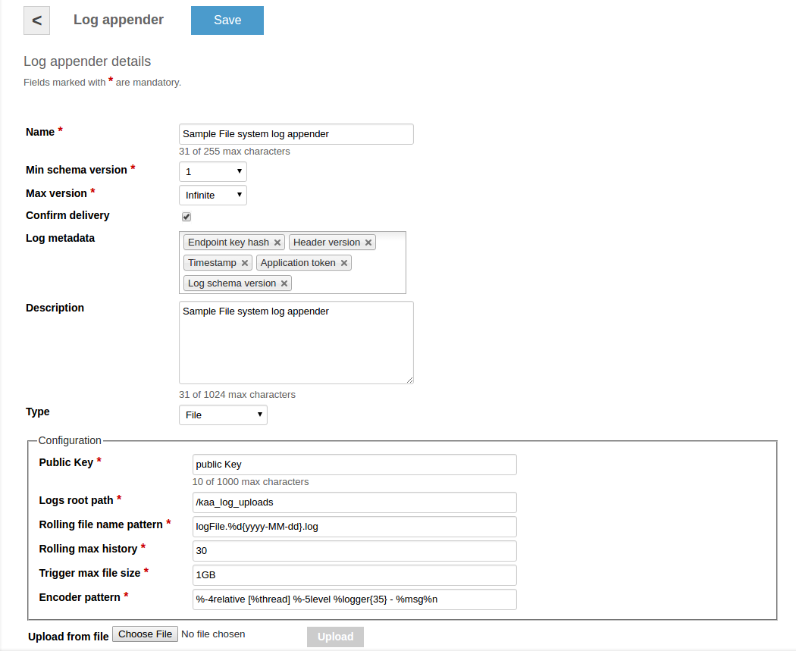
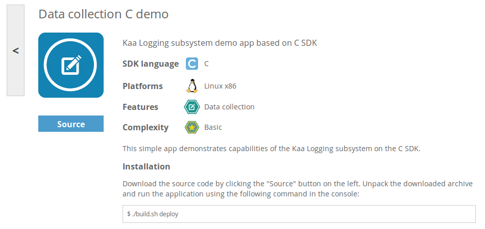
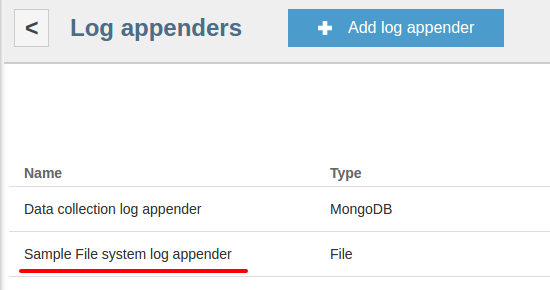



* TOC
{:toc}

The file system log appender stores received logs into the local file system of the Operations service. This log appender may be used for test purposes
or in pair with tools like Flume etc. Logs are stored in files under the ```/$logsRootPath/tenant_$tenantId/application_$applicationId``` folder,
where _logsRootPath_ is a configuration parameter, _tenantId_ and _applicationId_ are ids of the current tenant and
the application respectively. Access to the logs is controlled via Linux file system permissions.

You can log in to the Operations service host and browse logs using the ```kaa_log_user_$applicationToken``` user name and the pubic key which is created as
a part of the configuration.

# Creating file system log appender in Admin UI

The easiest way to create a file system log appender for your application is by using Admin UI.
To create a log appender of the file system storage type, do the following:

1. In the **Log appenders** window, click **Add log appender**.
2. Enter the log appender name and description, select the minimum and maximum supported log schema version, and select necessary log metadata fields.
3. Set the log appender type to _File_.
4. Fill in other fields as required.
5. Click **Add** button. Log appender is ready and operational at this point.



# Creating file system log appender with Admin REST API

It is also possible to create a file system log appender for your application by using [Admin REST API]({{root_url}}Programming-guide/Server-REST-APIs/#!/Logging/editLogAppender).
The following example illustrates how to create the file system log appender via Admin REST API.

## Configuration

The file system log appender configuration must match to
[this]({{github_url}}server/appenders/file-appender/src/main/avro/file-appender-config.avsc) Avro schema.

Parameters for defining file system log appender:

|Name                   |Description                    |
|-----------------------|-------------------------------|
|publicKey              |Name of public key             |
|logsRootPath           |Root path for logs             |
|rollingFileNamePatern  |Pattern for creating file name |
|rollingMaxHistory      |Max number for records in file |
|triggerMaxFileSize     |Max size of file               |
|encoderPattern         |Pattern for encoder            |

An example configuration that matches to previously introduced Avro schema is as below:

```json
{
    "publicKey":"public Key",
    "logsRootPath":"/kaa_log_uploads",
    "rollingFileNamePatern":"logFile.%d{yyyy-MM-dd}.log",
    "rollingMaxHistory":30,
    "triggerMaxFileSize":"1GB",
    "encoderPattern":"%-4relative [%thread] %-5level %logger{35} - %msg%n"
}
```

## Administration

The following Admin REST API call example illustrates how to create a new file system log appender.

```bash
curl -v -S -u devuser:devuser123 -X POST -H 'Content-Type: application/json' -d @fileSystemLogAppender.json "http://localhost:8080/kaaAdmin/rest/api/logAppender" | python -mjson.tool
```

where file ```fileSystemLogAppender.json``` contains following data:

```json
{
    "pluginClassName":"org.kaaproject.kaa.server.appenders.file.appender.FileSystemLogAppender",
    "pluginTypeName":"File",
    "applicationId":"5",
    "applicationToken":"82635305199158071549",
    "name":"Sample File system log appender",
    "description":"Sample File system log appender",
    "headerStructure":[
        "KEYHASH",
        "VERSION",
        "TIMESTAMP",
        "TOKEN",
        "LSVERSION"
    ],
    "maxLogSchemaVersion":2147483647,
    "minLogSchemaVersion":1,
    "tenantId":"1",
    "jsonConfiguration":"{\"publicKey\":\"public Key\",\"logsRootPath\":\"/kaa_log_uploads\",\"rollingFileNamePatern\":\"logFile.%d{yyyy-MM-dd}.log\",\"rollingMaxHistory\":30,\"triggerMaxFileSize\":\"1GB\",\"encoderPattern\":\"%-4relative [%thread] %-5level %logger{35} - %msg%n\"}"
}
```

Example result:

```json
{
    "applicationId":"5",
    "applicationToken":"82635305199158071549",
    "confirmDelivery":true,
    "createdTime":1466154396923,
    "createdUsername":"devuser",
    "description":"Sample File system log appender",
    "headerStructure":[
        "KEYHASH",
        "VERSION",
        "TIMESTAMP",
        "TOKEN",
        "LSVERSION"
    ],
    "id":"131072",
    "jsonConfiguration":"{\"publicKey\":\"public Key\",\"logsRootPath\":\"/kaa_log_uploads\",\"rollingFileNamePatern\":\"logFile.%d{yyyy-MM-dd}.log\",\"rollingMaxHistory\":30,\"triggerMaxFileSize\":\"1GB\",\"encoderPattern\":\"%-4relative [%thread] %-5level %logger{35} - %msg%n\"}",
    "maxLogSchemaVersion":2147483647,
    "minLogSchemaVersion":1,
    "name":"Sample File system log appender",
    "pluginClassName":"org.kaaproject.kaa.server.appenders.file.appender.FileSystemLogAppender",
    "pluginTypeName":"File",
    "tenantId":"1"
}
```

# Playing with File system log appender

1. Go to Data collection demos in Sandbox. And download binary.

2. Follow **Installation** instructions.
3. In the Admin UI follow to **Data collection demo** application.
4. Go to application's **Log appenders** configuration and add a new one.

5. Enter name of the new appender (we use “Sample File system log appender”).
6. Add Log metadata fields.
7. Select **File** appender type.

    See [Creating file system log appender in Admin UI](#creating-file-system-log-appender-in-admin-ui) section for details.

8. Verify that newly created appender has appeared in list.

9. Use instructions from Sandbox to run Data collection demo application.
10. After this you should see something like below:

    ```bash
    Data collection demo started
    Received new sample period: 1
    Sampled temperature 28 1474622330
    Sampled temperature 31 1474622331
    Sampled temperature 32 1474622332
    Sampled temperature 30 1474622333
    Sampled temperature 28 1474622334
    ...
    ```

11. Let's verify that our logs have been persisted in the local file system. Go to Sandbox VM and open the file
        ```/kaa_log_uploads/tenant_'number_of_tenant'/application_'your_application_token'/application.log```.
        In this example path to file ```application.log``` is ```/kaa_log_uploads/tenant_1/application_24212667430286144698/```.

     Your ```application.log``` should contain similar content:

    ```bash
    643854 [EPS-log-dispatcher-10] INFO  1.24212667430286144698 - {"Log Header": "{"endpointKeyHash":{"string":"tqoeo8S49HgakOV/2DfiEZLjGls="},"applicationToken":{"string":"24212667430286144698"},"headerVersion":{"int":1},"timestamp":{"long":1474622333932},"logSchemaVersion":{"int":2}}", "Event": {"temperature":28,"timeStamp":1474622330}}
    643854 [EPS-log-dispatcher-10] INFO  1.24212667430286144698 - {"Log Header": "{"endpointKeyHash":{"string":"tqoeo8S49HgakOV/2DfiEZLjGls="},"applicationToken":{"string":"24212667430286144698"},"headerVersion":{"int":1},"timestamp":{"long":1474622333932},"logSchemaVersion":{"int":2}}", "Event": {"temperature":31,"timeStamp":1474622331}}
    643854 [EPS-log-dispatcher-10] INFO  1.24212667430286144698 - {"Log Header": "{"endpointKeyHash":{"string":"tqoeo8S49HgakOV/2DfiEZLjGls="},"applicationToken":{"string":"24212667430286144698"},"headerVersion":{"int":1},"timestamp":{"long":1474622333932},"logSchemaVersion":{"int":2}}", "Event": {"temperature":32,"timeStamp":1474622332}}
    643854 [EPS-log-dispatcher-10] INFO  1.24212667430286144698 - {"Log Header": "{"endpointKeyHash":{"string":"tqoeo8S49HgakOV/2DfiEZLjGls="},"applicationToken":{"string":"24212667430286144698"},"headerVersion":{"int":1},"timestamp":{"long":1474622333932},"logSchemaVersion":{"int":2}}", "Event": {"temperature":30,"timeStamp":1474622333}}
    643854 [EPS-log-dispatcher-10] INFO  1.24212667430286144698 - {"Log Header": "{"endpointKeyHash":{"string":"tqoeo8S49HgakOV/2DfiEZLjGls="},"applicationToken":{"string":"24212667430286144698"},"headerVersion":{"int":1},"timestamp":{"long":1474622333932},"logSchemaVersion":{"int":2}}", "Event": {"temperature":28,"timeStamp":1474622334}}
    ...
    ```

If your output doesn't match above one, please follow our [troubleshooting guide]({{root_url}}Administration-guide/Troubleshooting).
